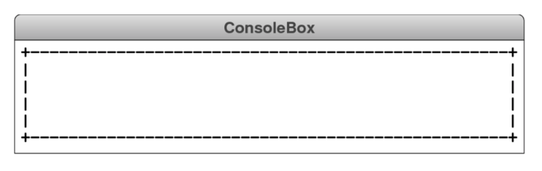

# CHALLENGE 5

Write a function drawConsoleBox(width, height) that draws a box on the console with the specified dimensions. The corners of the box should be represented using a plus sign (+), the top and bottom borders using a minus sign (-), and the left and right borders using a vertical bar (|). For example, calling drawConsoleBox(52, 6) should produce the following diagram:

